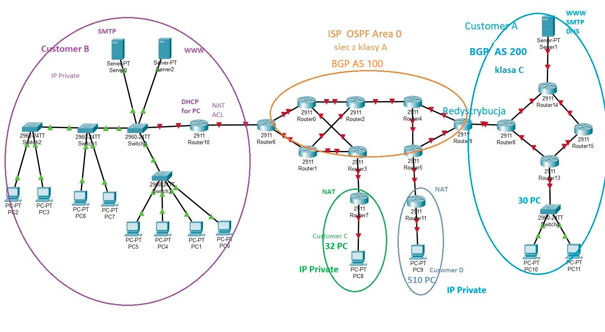

# ciscoLab
Osoby:
* Hubixo
* Remigiusz
* VladKoz
* wojexe

## Opis
Zadanie powinno byc zrobione w pakiet tracerze, plik znajduje sie w folderze.


 
 
## Rozwiazania
 #### Adresacja sieci IPv4 z najmniejszej liczby adresow IP 10 [VladKoz] ✅
Adresacja sieci z najmniejsza liczba adresow:  przerabiamy algorytm z cwiczen, czyli bierzemy ilosc urzadzen+2 po czym liczymy minimalna potege dwojki i z tego dostajemy maske.
```
Siec Customer A:
    Podsiec 1.0.1.0 ma 2 urzadzenia  Maska 255.255.255.252 = /30
    Podsiec 1.0.2.0 ma 3 urzadzenia  Maska 255.255.255.248 = /29
    Podsiec 1.0.3.0 ma 2 urzadzenia  Maska 255.255.255.252 = /30
    Podsiec 1.0.4.0 ma 2 urzadzenia  Maska 255.255.255.252 = /30
    Podsiec 1.0.5.0 ma 2 urzadzenia  Maska 255.255.255.252 = /30
    Podsiec 1.0.6.0 ma 2 urzadzenia  Maska 255.255.255.252 = /30

Siec Customer B:
    11 urzadzen. 
    2.0.0.0 - siec. Maska 255.255.255.240 = /28

Siec Customer C:
    2 urzadzenia. 
    3.0.0.0 - siec. Maska 255.255.255.252 = /30

Siec Customer D:
    2 urzadzenia. 
    4.0.0.0 - siec. Maska 255.255.255.252 = /30
    
Klasa A
    podsiec 
    Podsiec 5.0.1.0 ma 2 urzadzenia  Maska 255.255.255.252 = /30
    ...
    Podsiec 5.0.15.0 ma 2 urzadzenia  Maska 255.255.255.252 = /30

```
#### Routing z BGP 10 / bez BGP 5 [_Osoba1_]❌ 
```

exit
router bgp 200 


```

#### VLAN'y 5 (minimum 4 vlany) [_Osoba1_] ❌

#### Etherchannel 5 [_Osoba2_] ❌

#### Redystrybucja 5 (z wersja BGP 10) [_Osoba2_] ❌

#### NAT 10 [_Osoba3_]❌

#### DHCP 10 [_Osoba3_] ❌

#### Ekstra fiber links w ISP 2 [_Osoba4_] ❌

#### ACL for WWW,SMTP 5 [_Osoba4_]❌

#### Mail serwer 3 [_Osoba4_] ❌

### Komentarze od prowadzacego
 Dla ISP dobrac siec publiczna z klasy A dla Klienta A siec publiczna z  klasy C

 Dla klientów bez podanych sieci trzeba dobrać siec z puli adresów prywatnych.

 Strony WWW (onu klientow) maja być dostępne ze wszystkich PC  Dla Klienta B dobrać alokacje VLAN'ów. 
